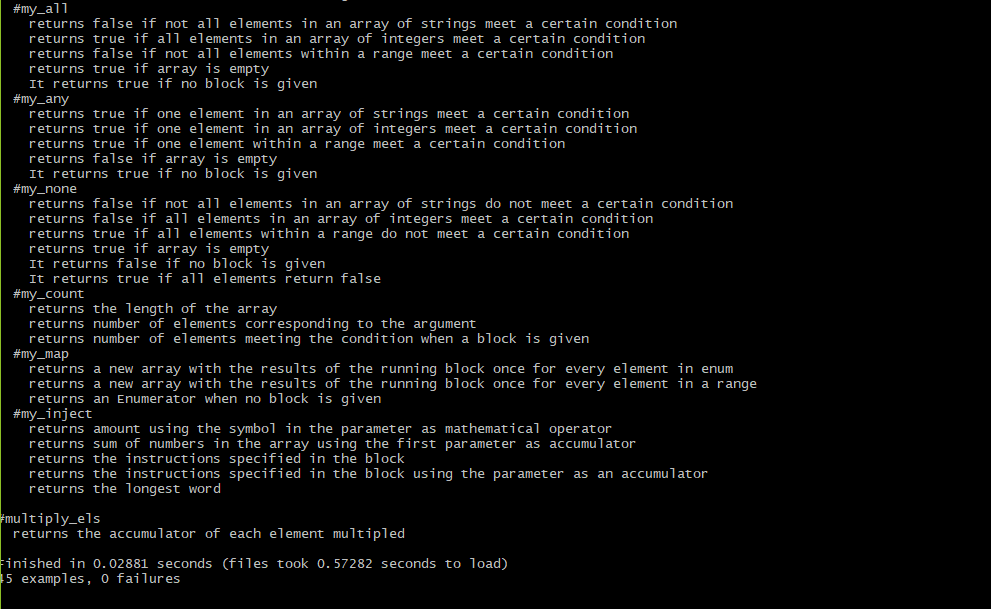

# Enumerable Methods

This project is about rebuilding some commonly used iterator methods using Ruby's Enumerable module

Listed below are the _iterator methods_ rebuilt in this project:

-   `my_each` - [each](https://ruby-doc.org/core-2.6.5/Enumerable.html#method-i-each_entry)
-   my_each_with_index - [each_with_index](https://ruby-doc.org/core-2.6.5/Enumerable.html#method-i-each_with_index)
-   my_select - [select](https://ruby-doc.org/core-2.6.5/Enumerable.html#method-i-select)
-   my_all? - [all?](https://ruby-doc.org/core-2.6.5/Enumerable.html#method-i-all-3F)
-   my_any? - [any?](https://ruby-doc.org/core-2.6.5/Enumerable.html#method-i-any-3F)
-   my_none? - [none?](https://ruby-doc.org/core-2.6.5/Enumerable.html#method-i-none-3F)
-   my_count - [count](https://ruby-doc.org/core-2.6.5/Enumerable.html#method-i-count)
-   my_map - [map](https://ruby-doc.org/core-2.6.5/Enumerable.html#method-i-map)
-   my_inject - [inject](https://ruby-doc.org/core-2.6.5/Enumerable.html#method-i-inject)

Then one more method `multiply_els` to test #my_inject method

## Built With

-   Ruby
-   Rubocop (Style guide cop :-D)

## Live Code

## Getting Started

To get a local copy of the repository please run the following commands on your terminal:

    $ git clone https://github.com/oracleot/ruby-enumerable-methods.git

    $ cd ruby-enumerable-methods/

## Test

1. Open a terminal
2. Run 'gem install rspec'
3. Run 'cd ruby-enumerables'
4. Run rspec --init’ to install rspec in directory

## Run

1. Run 'rspec' in the terminal
2. In the terminal, you should see if the tests pass or fail.

## Authors

👤 ** Kamwa Emmanuelle Alix**

-   Github: [emmanuellekamwa](https://github.com/emmanuellekamwa)
-   Twitter: [@twitterhandle](https://twitter.com/AlixKamwa)
-   Linkedin: [linkedin](https://linkedin.com/in/emmanuelle-kamwa-86145a1a4/)

👤 **Damilola Oduronbi**

-   Github: [oracleot](https://github.com/oracleot)

👤  **Ntwali Heritier**

- Github: [@NtwaliHeritier](https://github.com/NtwaliHeritier)
- Twitter: [@NtwaliHeritier](https://twitter.com/NtwaliHeritier)
- Linkedin: [Ntwali Heritier](https://linkedin.com/in/ntwali-heritier-9950001a2)

## 🤝 Contributing

Contributions, issues and feature requests are welcome!

## Show your support

Give a ⭐️ if you like this project!
